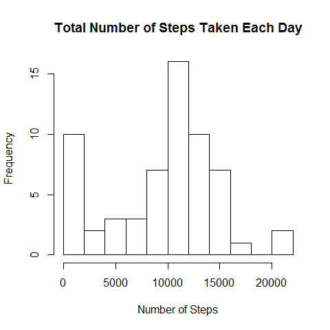
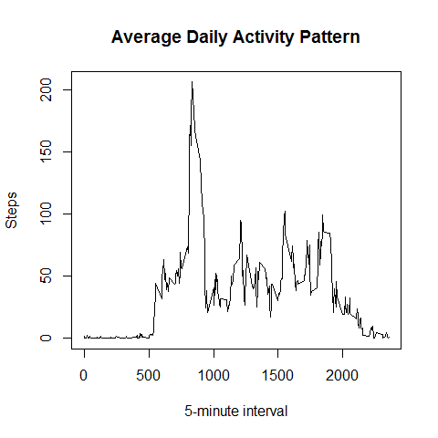
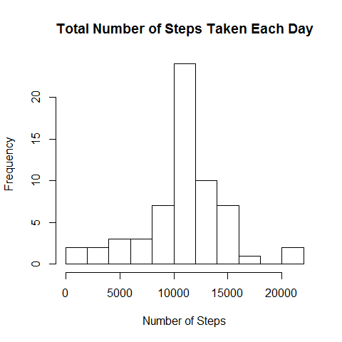
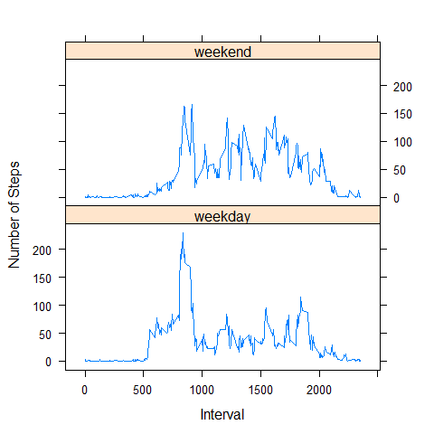

# Peer Assessment 1
Kyle KC Bao  
February 18, 2016  

### Loading and preprocessing the data

Show any code that is needed to

1. Load the data (i.e. `read.csv()`)

2. Process/transform the data (if necessary) into a format suitable for your analysis


```r
## Code for reading in the dataset and/or processing the data
if (!file.exists("activity.zip")) {
  download.file("https://d396qusza40orc.cloudfront.net/repdata%2Fdata%2Factivity.zip",
                "activity.zip")
}
if (!file.exists("activity.csv")) {
  unzip("activity.zip")
}
data <- read.csv("activity.csv", colClasses = c("numeric", "character"))
data$date <- as.Date(data$date)
```

### What is mean total number of steps taken per day?

For this part of the assignment, you can ignore the missing values in
the dataset.

1. Make a histogram of the total number of steps taken each day


```r
## Histogram of the total number of steps taken each day
daily.steps <- aggregate(data$steps, by = list(data$date),
                         FUN = sum, na.rm = TRUE)
colnames(daily.steps) <- c("date", "steps")
with(daily.steps, hist(steps, breaks = 10, xlab = "Number of Steps",
                       main = "Total Number of Steps Taken Each Day"))
```



2. Calculate and report the **mean** and **median** total number of steps taken per day


```r
## Mean and median number of steps taken each day
mean(daily.steps$steps) # mean
```

```
## [1] 9354.23
```

```r
median(daily.steps$steps) # median
```

```
## [1] 10395
```

### What is the average daily activity pattern?

1. Make a time series plot (i.e. `type = "l"`) of the 5-minute interval (x-axis) and the average number of steps taken, averaged across all days (y-axis)


```r
## Time series plot of the average number of steps taken
average.steps <- aggregate(data$steps, by = list(data$interval),
                           FUN = mean, na.rm = TRUE)
colnames(average.steps) <- c("interval", "steps")
with(average.steps, plot(interval, steps, type = "l",
                         xlab = "5-minute interval",
                         ylab = "Steps",
                         main = "Average Daily Activity Pattern"))
```



2. Which 5-minute interval, on average across all the days in the dataset, contains the maximum number of steps?


```r
## The 5-minute interval that, on average, contains the maximum number of steps
average.steps[which.max(average.steps$steps), "interval"]
```

```
## [1] 835
```

### Imputing missing values

Note that there are a number of days/intervals where there are missing
values (coded as `NA`). The presence of missing days may introduce
bias into some calculations or summaries of the data.

1. Calculate and report the total number of missing values in the dataset (i.e. the total number of rows with `NA`s)


```r
## Total missing data
sum(is.na(data$steps))
```

```
## [1] 2304
```

2. Devise a strategy for filling in all of the missing values in the dataset. The strategy does not need to be sophisticated. For example, you could use the mean/median for that day, or the mean for that 5-minute interval, etc.


```r
## Function to change NA values to average steps for that interval of the day
InputMissing <- function(x) {
  idx <- which(is.na(x$steps))
  for (i in 1:length(idx)) {
    x[idx[i], "steps"] <- average.steps[average.steps$interval == 
                                        x[idx[i], "interval"], "steps"]
  }
  x
}
```

3. Create a new dataset that is equal to the original dataset but with the missing data filled in.


```r
## Create a new dataset that is equal to the original dataset but with the 
## missing data filled in.
data.new <- InputMissing(data)
```

4. Make a histogram of the total number of steps taken each day and Calculate and report the **mean** and **median** total number of steps taken per day. Do these values differ from the estimates from the first part of the assignment? What is the impact of imputing missing data on the estimates of the total daily number of steps?


```r
## Histogram of the total number of steps taken each day
daily.steps.new <- aggregate(data.new$steps, by = list(data.new$date), 
                             FUN = sum, na.rm = TRUE)
colnames(daily.steps.new) <- c("date", "steps")
with(daily.steps.new, hist(steps, breaks = 10, xlab = "Number of Steps", 
                           main = "Total Number of Steps Taken Each Day"))
```



```r
mean(daily.steps.new$steps) # new mean
```

```
## [1] 10766.19
```

```r
mean(daily.steps.new$steps) - mean(daily.steps$steps) # difference in mean
```

```
## [1] 1411.959
```

```r
median(daily.steps.new$steps) # new median
```

```
## [1] 10766.19
```

```r
median(daily.steps.new$steps) - median(daily.steps$steps) # difference in median
```

```
## [1] 371.1887
```

```r
# Values differ from first part of assignment.
# Inputting missing data increases the estimates of the total daily number of
# steps.
```

### Are there differences in activity patterns between weekdays and weekends?

For this part the `weekdays()` function may be of some help here. Use
the dataset with the filled-in missing values for this part.

1. Create a new factor variable in the dataset with two levels -- "weekday" and "weekend" indicating whether a given date is a weekday or weekend day.


```r
## Function to create factor variable based on weekday/weekend in dataset
WhichDay <- function(x) {
  results <- vector()
  for (i in 1:nrow(x)) {
    if (weekdays(x[i, "date"]) %in% c("Saturday", "Sunday")) {
      results <- c(results, "Weekend")
    } else {
      results <- c(results, "Weekday")
    }
  }
  
  results
}

## Adds new factor variable to dataset
data.new$day <- WhichDay(data.new)
data.new$day <- factor(data.new$day, levels = c("Weekday", "Weekend"), 
                       labels = c("weekday", "weekend"))
```

2. Make a panel plot containing a time series plot (i.e. `type = "l"`) of the 5-minute interval (x-axis) and the average number of steps taken, averaged across all weekday days or weekend days (y-axis). The plot should look something like the following, which was created using **simulated data**:


```r
## Creates time series plot comparing average steps across weekday/weekend days. 
average.steps.new <- aggregate(data.new$steps, 
                               by = list(data.new$interval, data.new$day), 
                               FUN = mean, na.rm=TRUE)
colnames(average.steps.new) <- c("interval", "day", "steps")

require(lattice)
```

```
## Loading required package: lattice
```

```r
xyplot(steps~interval | day, data = average.steps.new,
       type = "l",
       xlab = "Interval",
       ylab = "Number of Steps",
       layout = c(1,2))
```



